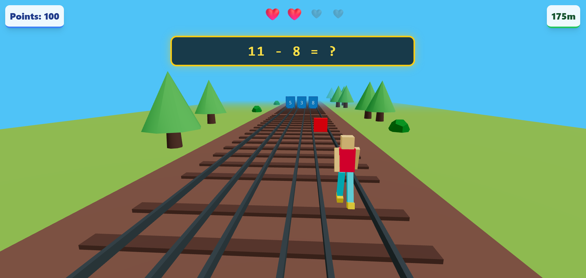

# 🏃‍♂️ Math Run

**Math Run** is a vibrant, 3D endless runner game designed to make learning mathematics fun and engaging, specifically tailored for autistic children.

The player navigates a character through a colorful subway-style track, avoiding obstacles and solving math problems by running through the correct answer gates.



## 🌟 Features

-   **Endless 3D Runner**: Infinite track generation with "Subway Surfers" style aesthetics.
-   **Educational Mechanics**: Math questions appear every 100m. Run through the blue gate with the correct answer to score points!
-   **Autism-Friendly Design**:
    -   High-contrast, vibrant colors.
    -   Simple, predictable controls.
    -   Forgiving gameplay (lives system instead of instant game over).
    -   Clear visual cues and feedback.
-   **Dynamic Gameplay**:
    -   Randomized obstacle placement (every ~25m).
    -   Three-lane system with jump and lane-switch mechanics.
    -   Progressive difficulty (speed increases over time).

## 🎮 Controls

| Action | Keyboard Key | Alternative |
| :--- | :--- | :--- |
| **Move Left** | `Left Arrow` | `A` |
| **Move Right** | `Right Arrow` | `D` |
| **Jump** | `Up Arrow` | `Space` / `W` |

## 🛠️ Tech Stack

-   **Framework**: [React](https://reactjs.org/) (Vite)
-   **3D Graphics**: [Three.js](https://threejs.org/) via [@react-three/fiber](https://docs.pmnd.rs/react-three-fiber)
-   **State Management**: [Zustand](https://github.com/pmndrs/zustand)
-   **Styling**: TailwindCSS

## 🚀 Getting Started

1.  **Clone the repository:**
    ```bash
    git clone https://github.com/Amarthya-afk/Math-Run.git
    cd Math-Run
    ```

2.  **Install dependencies:**
    ```bash
    npm install
    ```

3.  **Run the development server:**
    ```bash
    npm run dev
    ```

4.  **Open the game:**
    Open your browser and navigate to `http://localhost:5173` (or the URL shown in your terminal).

## 🤝 Contributing

Contributions are welcome! If you have ideas to improve accessibility or add new math topics, feel free to open an issue or pull request.

## 📄 License

This project is open-source and available under the [MIT License](LICENSE).
